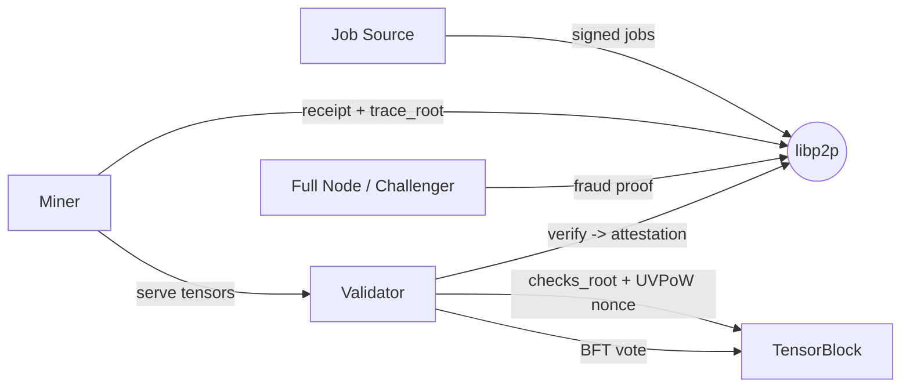

# Useful-Work Chain Specification

**Status:** Design draft (v0). Not a production security proof.
**Scope:** A standalone blockchain whose native proof-of-work is the *verification of useful tensor computation*. Miners execute deterministic tensor workloads; validators verify them with cheaper-than-recompute checks and mine blocks over the verification result; the chain's validity rule *is* the correctness of that work.

This spec unifies three things:

1. A fully-specified, content-addressed tensor IR as the workload language (§4).
2. A useful-verification PoW over deterministic settled-receipt blockspace as the consensus model.
3. An interactive fraud-proof layer over execution-trace commitments, which extends verification beyond linear algebra to general nonlinear workloads.

Throughout, the load-bearing idea is stated once and reused:

> **Security comes from the asymmetry between doing the work and checking the work, anchored to stake.** A miner must do `O(expensive)` tensor compute; any honest validator can detect a false result for `O(cheap)`; a false result that survives is an economic loss (slashing) larger than the reward for faking it. The chain only finalizes work that passed cheap verification, so *block validity and work-correctness are the same predicate*.

---

## 0. Glossary

| Term | Meaning |
|---|---|
| **Workload / Job** | A deterministic tensor program: an IR graph + bound inputs + verification policy. |
| **Receipt** | A miner's signed claim that it executed a job, committing to outputs and an execution trace. |
| **Attestation** | A validator's signed result of verifying a receipt (pass / fail / inconclusive + evidence). |
| **`checks_root`** | Merkle root over the canonical set of validator checks for a block's settled receipts. |
| **Useful-Verification PoW (UVPoW)** | The block-production puzzle: a nonce search bound to a validator's `checks_root` commitment. |
| **Settled receipt** | A receipt that has accumulated the required attestations and is eligible for blockspace. |
| **Trace root** | Merkle root over per-op output commitments of an execution, enabling interactive fraud proofs. |
| **Field `F_p`** | The prime field all consensus-critical arithmetic happens in. |
| **TensorWork** | A reward/telemetry metric for miners. **Never** selects proposers or influences consensus. |

---

## 1. Thesis & Non-Goals

### 1.1 Thesis
Traditional PoW proves energy was burned on hash preimage search. This chain proves, within explicit soundness bounds, that **tensor state transitions were computed according to canonical deterministic semantics** — and recycles that proof as the block-production mechanism.

### 1.2 Non-Goals (v0)
- Arbitrary floating-point output as consensus state.
- Full Transformer training as a single consensus step.
- General smart contracts / a Turing-complete VM as consensus.
- On-chain storage of full tensors.
- ZKML for the whole workload.
- Subjective "usefulness" scoring.

These are roadmap items (§13), not v0.

---

## 2. System Roles (hard process boundaries)

Roles are **separate long-running processes** with distinct keys, durable state, and network identities. Jobs, receipts, attestations, tensor fetches, blocks, and votes cross process boundaries over p2p/RPC before they affect another node. No single process may mutate multiple counted roles in memory.

- **Miner.** Subscribes to jobs, executes the IR on its hardware (GPU allowed), publishes receipts, and serves tensor data for verification.
- **Validator.** Verifies settled receipts (the actual "work"), builds `checks_root`, performs UVPoW, proposes blocks, and casts stake-weighted finality votes. **Block proposal is validator-owned.** There is no separate miner-proposer role.
- **Full node.** Validates and relays blocks; can challenge (see §8); does not necessarily stake.
- **Job source.** Emits deterministic, content-addressed jobs (synthetic in v0; externally-useful workloads later). Job emission must be deterministic and verifiable so no party can grind job content to advantage a miner.



---

## 3. Determinism Contract (the foundation)

Consensus-critical computation MUST be bit-exact reproducible across machines. Verification is by **equality of commitments**, never by floating-point tolerance.

### 3.1 Arithmetic domain
- All consensus-critical values are elements of a prime field **`F_p`** (e.g. a 61-bit or 64-bit-friendly prime; final choice in §12).
- Real-valued workloads use **fixed-point**: a value `x` is encoded as `round(x · 2^s) mod p` for a per-tensor scale `s` declared in the IR. All scale handling (rescale after multiply, rounding mode, saturation) is canonical and part of the op semantics.
- Integer workloads map directly into `F_p`.
- Overflow, rounding (round-half-to-even), and tensor memory layout (row-major, canonical dtype tags) are fixed by spec.

### 3.2 Hardware policy
- Miners MAY use GPU/CUDA kernels for speed, but the **committed output must equal the canonical `F_p` semantics**. A GPU kernel that produces a near-but-not-equal result yields an invalid receipt.
- Banned from the consensus path: nondeterministic CUDA reductions, fused kernels whose reduction order is unspecified, any fp16/bf16/fp32 value as committed state.

### 3.3 Why this matters
Equality-of-commitment verification (Freivalds, hash equality, fraud-proof bisection) is only sound if all honest nodes agree on every bit. The fixed-point/field contract is what makes "anyone can recompute one op and rule on it" possible. **This is the single hardest engineering constraint in the system; everything else depends on it.**

> Status: the local reference now publishes a conformance vector suite for the current executable exact
> `F_p` ops used by TensorOp and LinearTrainingStep, and receipt verification gates those current jobs on
> the matching suite profile. The suite now carries per-input and expected output dtype/scale metadata for
> fixed-point `cast`/`round` half-even rescale vectors, `Fixed32` `mul` half-even rescale vectors
> including mixed-scale product rescale, exact field modular-inverse and `Fixed32` reciprocal `div`,
> exact Tier-A matrix-contraction `einsum`, plus multi-output expected tensors for exact per-channel int8
> quantize scale output. `int8`, `uint8`, and `bool` dtype tags are implemented, exact
> `quantize_int8_per_channel`/`dequantize_int8_per_channel` vectors are CPU-conformance covered, and
> `quantize_pack_int8`/`unpack_dequantize_int8` use a byte-exact flat `uint8` payload vector. Fixed-scale
> comparison masks and int8 selection are also conformance covered. Local A100 CUDA pass evidence now
> covers the current executable CUDA TensorOp/LinearTrainingStep runtime paths: CUDA field matmul edge
> cases, exact linear tensor ops, canonical matmul backend parity, linear-step backend parity, and live
> miner-role receipt submission for those two paths through `tvmd miner run --device cuda:N` runtime
> config pass under `--features cuda-kernels`. CUDA graph receipt evidence now covers the current local
> synthetic GraphExecution shape (`add` -> `relu`) plus a focused supported-op CUDA graph
> (`matmul`/`add`/`sub`/`mul`/`div`/`clamp`/`sum`/`mean`/`reshape`/`squeeze`/`unsqueeze`/`broadcast`/`transpose`/`scalar_mul`/`relu`/`identity`/`neg`/`abs`/`sign`/`eq`/`gt`/`lt`/`ge`/`le`/`where`)
> through the CUDA miner backend with bit-exact CPU/GPU receipt roots. CUDA conformance reporting is
> limited to the exercised field subset instead of over-claiming binary op broadcasting, vector clamp
> bounds, fixed-point division/comparisons/selection/clamp/broadcast/mean/reshape/squeeze/unsqueeze, fixed-point or broadcast
> reductions, slice/split/concat/stack, bool masks, or the full CPU reference profile. The full frozen-registry CUDA vector suite and
> Tier-C/transcendental vector references remain TODO before claiming complete §3.3 coverage for every
> runtime.

---

## 4. The Workload Primitive: Tensor IR (full specification)

Workloads are expressed as a **content-addressed tensor IR graph**. This section specifies the IR completely and self-containedly: its value model, node structure, canonical encoding, structural validity rules, the frozen op registry, and the determinism obligations each op must satisfy. Nothing in the IR refers to any external implementation; a conformant runtime is defined entirely by this section plus the determinism contract (§3).

### 4.1 Value model
Every IR value is a **tensor**: a dense, row-major array of field elements with a declared shape and a numeric encoding.

- **`dtype`** is one of:
  - `field` — a raw element of `F_p`.
  - `fixedNN_s` — a real number encoded as a fixed-point field element with `NN` logical bits and binary scale `s` (value `v` represents `v·2^{−s}`, stored as `round(v·2^s) mod p`).
  - `int64`, `int32`, `int8`, `uint8`, `bool` — exact integers embedded in `F_p` (used for indices, masks, packed bytes). Integer values MUST lie in `[0, p)` after embedding; negative integers embed as `x mod p`.
- **Shape** is a list of non-negative integers. A declared shape dimension of `-1` in an *input* `TensorSpec` means "unconstrained at definition time, fixed by the bound input." All other shapes are concrete.
- There is **no floating-point dtype** in the consensus path. Floating point may exist only inside a miner's accelerator as an optimization, never as a committed value (§3.2).

```text
TensorSpec { name: string, shape: [int], dtype: DType, scale: int }   // scale used iff dtype is fixedNN
ParamSpec  { name: string, type: string }                              // declares a bound parameter slot
```

### 4.2 Refs (how an op names its inputs)
An op argument or keyword value is either a literal or a **ref**. A ref is a tagged object with a `kind`:

| `kind` | Fields | Resolves to |
|---|---|---|
| `input` | `name` | the bound graph input tensor `name` |
| `op` | `id`, `idx` (default 0) | output `idx` of the op with that `id` |
| `param` | `name` | the bound parameter `name` |
| `const` | `value` | an inline literal (scalar, list, or small tensor of field/int values) |
| `const_blob` | `uri`, `shape`, `dtype` | a large constant tensor fetched by content address (`uri` is a tensor commitment, §5.1), shape/dtype asserted on load |

Refs make data flow explicit and pure: an op's inputs are fully determined by graph inputs, params, consts, and the outputs of strictly-earlier ops. This SSA-like, side-effect-free structure is what makes a single op re-executable in isolation during a fraud proof (§8.2).

### 4.3 Op
```text
Op {
  id:     int           // equals the op's index in Graph.ops (0-based, gap-free)
  op:     string        // a name in the frozen registry (§4.7)
  args:   [Ref]         // positional inputs, count fixed by the op's arity
  kwargs: { string: (Ref | literal) }   // keys restricted to the op's declared kwarg set
  out:    [TensorSpec]  // declared outputs; length matches the op's output count
}
```
Multi-output ops (e.g. `split`, `topk`, `qr`) declare multiple `out` specs and are referenced via `{kind:"op", id, idx}`.

### 4.4 Graph
```text
Graph {
  ir_version: int
  inputs:  [TensorSpec]                 // names unique
  params:  [ParamSpec]                  // names unique
  ops:     [Op]                         // topologically ordered: op i may only ref ops < i
  outputs: [{ name: string, ref: Ref }] // named graph outputs, each pointing at a ref
}
```

### 4.5 Canonical encoding & `graph_id`
- The graph serializes to **canonical JSON**: object keys sorted lexicographically, no insignificant whitespace, UTF-8, integers as decimal, field elements as fixed-width lowercase hex.
- `graph_id = SHA256(canonical_json(graph))`.
- Jobs reference a graph **only** by `graph_id`; the program is therefore immutable and content-addressed. Two graphs with identical `graph_id` are identical programs by construction.

> Status: current TensorOp and LinearTrainingStep jobs store their validated canonical graph bodies in
> chain state keyed by `graph_id`, persist those bodies through node-store snapshots, commit them in the
> state root, and can serve them through the existing `RequestProgram`/`ProgramResponse` libp2p path.
> Current canonical TensorOp and LinearTrainingStep receipts derive `trace_root` from exact execution of
> their canonical TensorGraph op traces. Generic `GraphExecution` jobs and receipts can reference
> registered canonical graph bodies, execute locally through miner role loops, attest through validator
> role loops, cross the shared p2p/node payload path, settle through delayed receipt rewards, and surface
> through explorer HTTP/WebSocket plus local checker evidence. CUDA graph execution now covers the current
> local synthetic GraphExecution shape and a supported same-shape field-op graph including elementwise
> `mul`/`div`, scalar-bounds field `clamp`, deterministic field `sum`, field `mean`, field
> `reshape`/`squeeze`/`unsqueeze`, unary field `broadcast`, exact field `identity`/`neg`/`abs`/`sign`, field comparison masks `eq`/`gt`/`lt`/`ge`/`le`, and mask-fed
> field `where` through miner-role `cuda:N` backend selection;
> broader CUDA graph op coverage
> and public deployed graph evidence remain TODO.

### 4.6 Structural validity rules
A graph is **structurally valid** iff all of the following hold (checked before any execution; an invalid graph cannot appear in a job):
1. `ops[i].id == i` for all `i` (dense, ordered ids).
2. Every `{kind:"op", id}` ref satisfies `id < i` for the referencing op `i` (acyclic, topologically ordered).
3. Every `{kind:"op", id, idx}` ref has `idx < len(ops[id].out)`.
4. Every `input`/`param` ref names a declared input/param.
5. `len(args)` equals the op's arity, or the op is variadic (arity `n`) and `len(args) ≥ 1`.
6. Every key in `kwargs` is in the op's declared kwarg set; required kwargs are present.
7. Every declared output `ref` resolves to a defined value.
8. All `inputs` and `params` names are unique; output `name`s are unique.
9. Shapes and dtypes are consistent with each op's typing rule (shape inference must succeed and match declared `out` specs).

> The flat, `id`-indexed, pure-ref DAG is exactly what makes interactive fraud proofs (§8) tractable: any op's inputs are fully determined by earlier committed op outputs, so a single op can be re-executed in isolation.

### 4.7 Frozen op registry
The op set is **frozen per protocol version**. Each op has a fixed arity, a fixed kwarg set, an output count, a verification **tier** (§4.8), and a **canonical `F_p` semantics** (the determinism obligation). Arity `n` denotes variadic. Outputs `1` unless noted.

**Elementwise binary** (Tier B) — arity 2, no kwargs, broadcasting per §4.8:
`add`, `sub`, `mul`, `div`*, `pow`*

**Elementwise unary** (arity 1, no kwargs):
- Tier B (exact in `F_p`): `neg`, `abs`, `sign`, `identity`, `round`, `relu`†
- Tier C (transcendental — require canonical fixed-point approximation, §4.8): `exp`, `log`, `sqrt`*, `sin`, `cos`, `sigmoid`, `tanh`, `gelu`, `silu`

**Comparison** (Tier B) — arity 2, no kwargs, output `bool`:
`gt`, `lt`, `ge`, `le`, `eq`

**Selection / shaping** (Tier B) — exact, structural:
| op | arity | kwargs | notes |
|---|---|---|---|
| `where` | 3 | — | `cond` is `bool` |
| `clamp` | 1 | `min`, `max` | |
| `cast` | 1 | `dtype` | re-encodes; scale changes are canonical rounding |
| `reshape` | 1 | `shape` | |
| `transpose` | 1 | `dims` | permutation |
| `broadcast` | 1 | `shape` | |
| `squeeze` | 1 | `dim` | |
| `unsqueeze` | 1 | `dim` | |
| `slice` | 1 | `dim`, `start`, `end` | |
| `concat` | n | `dim` | |
| `stack` | n | `dim` | |
| `split` | 1 | `sizes`, `dim` | outputs = len(`sizes`) |
| `tril` | 1 | `diagonal` | |
| `triu` | 1 | `diagonal` | |

**Linear / bilinear** (Tier A — Freivalds, §6):
| op | arity | kwargs | notes |
|---|---|---|---|
| `matmul` | 2 | — | the canonical Tier-A op |
| `einsum` | 2 | `equation` | **only** contraction/permutation equations are Tier A; others reduce to Tier B/C |

**Reductions**:
| op | arity | kwargs | tier | notes |
|---|---|---|---|---|
| `sum` | 1 | `dim`, `keepdim` | B | exact; random-linear checkable |
| `mean` | 1 | `dim`, `keepdim` | B | fixed-point division by count is canonical |
| `max` | 1 | `dim`, `keepdim` | C | data-dependent |
| `min` | 1 | `dim`, `keepdim` | C | data-dependent |

**Indexing / gather-scatter** (Tier C — need index-consistency arguments, §7 TODO):
| op | arity | kwargs | notes |
|---|---|---|---|
| `gather` | 2 | `dim` | index tensor is `int64` |
| `scatter` | 3 | `dim` | |
| `embedding` | 2 | — | `embedding(weight, ids)`; Tier B w/ index-consistency |

**Generators** (arity 0):
| op | arity | kwargs | tier | notes |
|---|---|---|---|---|
| `arange` | 0 | `start`, `end`, `step`, `dtype` | B | exact, deterministic |
| `full` | 0 | `shape`, `value`, `dtype` | B | exact |
| `normal` | 0 | `seed`, `shape`, `dtype` | C | **canonical PRNG over `F_p` required** (§4.8) |
| `uniform` | 0 | `seed`, `shape`, `dtype` | C | canonical PRNG required |

**Order statistics & normalization** (Tier C):
| op | arity | kwargs | outputs | notes |
|---|---|---|---|---|
| `sort` | 1 | `dim`, `descending` | 1 | stable order canonical |
| `topk` | 1 | `k`, `dim` | 2 (values, indices) | tie-break canonical |
| `softmax` | 1 | `dim` | 1 | transcendental → fixed-point approx |
| `log_softmax` | 1 | `dim` | 1 | transcendental |
| `layer_norm` | 3 | `eps` | 1 | `(x, weight, bias)`; involves `sqrt` |
| `rmsnorm` | 2 | `eps` | 1 | `(x, weight)`; involves `rsqrt` |
| `cross_entropy` | 2 | `ignore_index` | 1 | `(logits, targets)`; transcendental |

**Quantization / packing** (Tier B/C, exact integer arithmetic):
| op | arity | kwargs | outputs | notes |
|---|---|---|---|---|
| `quantize_int8_per_channel` | 1 | `dim` | 2 (q, scale) | round-half-even canonical |
| `dequantize_int8_per_channel` | 2 | — | 1 | exact |
| `quantize_pack_int8` | 1 | `dim` | 1 | byte-exact packing |
| `unpack_dequantize_int8` | 1 | `dim`, `shape`, `scale_dim` | 1 | byte-exact |

**Linear algebra & data** (Tier C):
| op | arity | kwargs | outputs | notes |
|---|---|---|---|---|
| `qr` | 1 | — | 2 (Q, R) | iterative → **excluded from v0 consensus** until a canonical fixed-point algorithm + tolerance-free check is specified |
| `data_indexer` | 1 | `B`, `T`, `mb_seed` | 2 (x, y) | canonical PRNG selects minibatch windows from a token stream |

\* `div`, `pow`, `sqrt`: division in `F_p` is either modular inverse (exact, for `field` dtype) or canonical signed fixed-point reciprocal division (exact integer quotient rescale for `Fixed32`). Roots remain Tier C until their canonical fixed-point references are published. The IR distinguishes the modes by operand dtype; mixing is a typing error.
† `relu` is exact in fixed-point (`max(x,0)`), so it is Tier B despite living in the activation family.

> Permissionless deployment of new ops is **not** allowed: a malicious or ill-defined op could be unverifiable. New ops are added only by protocol upgrade, each shipping (a) a canonical `F_p` semantics, (b) a verification tier + verifier, and (c) a soundness bound.

### 4.8 Determinism obligations per op class
Each op MUST have a single canonical `F_p` result for given inputs, identical on every conformant runtime:
- **Exact ops** (Tier A/B integer & fixed-point arithmetic, shaping, comparisons): the field/fixed-point operation is exact; the only freedom is rounding after scale changes, which is **round-half-to-even** by spec, and broadcasting, which follows the canonical NumPy-style rule with a fixed alignment.
- **Reductions**: the reduction order is **fixed** (ascending index order) so fixed-point accumulation is bit-identical; no hardware reduction-tree freedom is permitted.
- **Transcendental ops** (`exp`, `log`, `sqrt`, trig, `sigmoid`, `tanh`, `gelu`, `softmax`, `log_softmax`, `cross_entropy`, `rmsnorm`, `layer_norm`): defined by a **canonical fixed-point reference algorithm** (specified polynomial/LUT + fixed iteration count + canonical rounding), not by an IEEE library call. Two runtimes agree because they run the *same* integer approximation, not because their floats happen to match. Until that reference is published per op, the op is **not consensus-eligible** (Tier C, deferred).
- **PRNG ops** (`normal`, `uniform`, `data_indexer`): use a **canonical, seeded, integer PRNG over `F_p`** (e.g. a counter-based PRF), never a platform RNG. Output is a pure function of `(seed, shape, dtype)`.
- **Order-dependent ops** (`sort`, `topk`, `max`, `min`, `argmax`-like): ties are broken by **lowest index**, making the result a total function of the input.

> TODO: publish the canonical fixed-point reference for each transcendental op with its error bound and a conformance vector set (§3.3). This is the gating work item for admitting Tier-C ops to consensus.

### 4.9 Canonical jobs (v0)
1. **`TensorOp`** — a single `matmul` `C = A·B` over `F_p`. The minimal verifiable unit, fully Freivalds-checkable.
2. **`LinearTrainingStep`** — forward (`X·W`), fixed-point loss, backward (`dW = Xᵀ·dY`), optimizer update (`W' = W − η·dW`). A real learning step whose pieces are all matmul-like → Freivalds-verifiable.

**v0 admits only ops whose canonical `F_p` semantics are fully specified and exactly verifiable:** Tier A (`matmul`, contraction `einsum`), the exact Tier B ops (elementwise integer/fixed-point arithmetic, `relu`, shaping, `sum`/`mean`, comparisons, exact quantization), plus whatever minimal set `LinearTrainingStep` requires. Transcendental and order-dependent ops are carried in the registry as the workload vocabulary but are gated out of consensus until §4.8 references and their verifiers exist (§13 roadmap).

---

## 5. Commitments & Records (commitments on-chain, tensors off-chain)

The chain never stores full tensors. On-chain: job defs, receipts, attestations, block metadata, reward/stake/slash state. Off-chain (served by miners, sampled by validators): tensor data, activations, traces.

### 5.1 Tensor commitment
A tensor commits as a **Merkle root over fixed-size chunks** of its canonical `F_p` byte encoding: `tensor_commit = MerkleRoot(chunks)`. This supports chunk-level availability sampling and selective disclosure.

### 5.2 Trace commitment
An execution produces a **trace root**: `trace_root = MerkleRoot([ op_output_commit(i) for i in topo_order ])`, where `op_output_commit(i)` commits the output tensor(s) of op `i`. The trace root is the anchor for interactive fraud proofs (§8). The local reference now derives this root from exact IR execution, verifies per-op Merkle openings for TensorOp, LinearTrainingStep, and GraphExecution receipts, and carries those openings over bounded libp2p request-response for sampling.

### 5.3 Records (all asymmetrically signed; sr25519/ed25519)

```text
Job {
  graph_id: Hash
  input_commitments: [TensorCommit]
  params: { scales, op-tier policy, ... }
  verification_policy: { freivalds_reps, sample_rate, redundancy_k, ... }
  deadline, created, job_id
  source_sig
}

Receipt {
  job_id, graph_id
  miner_pubkey
  input_commitments:  [TensorCommit]   // must equal Job's
  output_commitments: [TensorCommit]
  trace_root: Hash                       // §5.2
  compute_metadata: { claimed_flops, time }   // telemetry only, never consensus
  bond: Stake                            // slashable
  miner_sig
}

Attestation {
  receipt_id
  validator_pubkey
  result: Pass | Fail | Inconclusive
  method: Freivalds | RandomLinear | Redundant | FraudProof
  evidence: { challenge_vectors, sampled_indices, ... }  // reproducible
  validator_sig
}
```

Every record's signed body is canonical JSON / SSZ; `*_id = SHA256(canonical(body))`.

> Status: the local reference computes current canonical TensorOp and LinearTrainingStep receipt
> `trace_root` values from the exact TensorGraph execution trace for the corresponding graph ID. Registered
> canonical graph bodies can also be used by `GraphExecution` jobs/receipts, and local role-owned synthetic
> production now executes and attests an exact Tier-B graph from node-local artifacts. The shared node
> payload path now keeps external graph jobs pending until their program bodies are registered, and focused
> libp2p evidence fetches externally supplied graph bodies plus input tensor artifacts before applying the
> graph job payload. Runtime ingest now fetches missing pending graph-program bodies over the bounded
> `RequestProgram` path before retrying queued graph jobs; miner role loops fetch missing graph input and
> `const_blob` tensors before execution; and validator role loops fetch graph input, output, and
> `const_blob` tensors before attestation. Local CPU graph receipt verification now has direct receipt
> scenarios for every consensus-admitted frozen-registry op, but CUDA/deployed graph verification evidence
> and broader public-runtime measurements remain open.

> **Crypto is asymmetric, full stop.** No HMAC/shared-secret signing anywhere in the consensus path. Identities are on-chain accounts.

---

## 6. Verification Ladder — Level 1: Freivalds (linear/bilinear)

For `C = A·B` (`A: m×k`, `B: k×n`), instead of recomputing (`O(mnk)`), a validator checks with a random vector `r ∈ F_p^n`:

```text
A·(B·r)  ==  C·r        cost: O(mn + nk + mk) = O(n^2)-class
```

- Soundness per repetition over `F_p`: a wrong `C` passes with probability `≤ 1/p` for a uniformly random `r` (Freivalds). With `t` independent reps, failure `≤ p^{-t}`. Pick `t` so `p^{-t}` is negligible (§12).
- **Full-output Freivalds** (checks all rows/cols) is mandatory for **block-eligible** receipts.
- **Row-sampled Freivalds** is cheaper but does **not** soundly catch sparse single-row corruption; it is allowed only for *telemetry/large-job triage*, never as the sole validity check for block eligibility. (Documented soundness gap — do not over-claim.)

Forward and backward passes of `LinearTrainingStep` are matmul-like and use Freivalds directly.

---

## 7. Verification Ladder — Level 2: Random-Linear Checks (affine/elementwise)

For elementwise/affine relations `Y = f(X)` where `f` is affine over `F_p` (e.g. `add`, `mul`-by-const, `reshape`, fixed-point `layer_norm` linear part), a random linear combination of the asserted equations gives algebraic coverage analogous to Freivalds:

```text
draw r; check  <r, Y - f(X)>  == 0   over F_p
```

This catches any nonzero error with probability `≥ 1 − 1/p` per rep. Used for Tier B ops that are not bilinear.

> Status: the frozen IR registry now carries an executable verifier classification for every current op.
> Tier-A `matmul` and the admitted rank-2 matrix-contraction `einsum` subset use full Freivalds;
> affine/reduction Tier-B relations used by the current
> LinearTrainingStep verifier (`add`/`sub`, scalar multiplication, `sum`/`mean`) are classified as
> random-linear-checkable; exact but non-affine structural/pointwise Tier-B ops require deterministic
> replay through the graph verifier and conformance profile; and `gather`/`scatter`/`embedding` are
> present only as non-admitted index-consistency-gated vocabulary. Runtime tensors now carry scale
> metadata, exact replay enforces `TensorSpec.scale`, fixed-point `cast`/`round`, mixed-scale `add`/`sub`,
> mixed-scale `mul`, `Fixed32` reciprocal `div`, and `Fixed32` `matmul` use canonical round-half-even
> rescale, and exact per-channel int8
> quantize/dequantize replay is conformance covered.
> Byte-packed int8 quantization now uses a tensor-owned canonical flat `uint8` payload API with explicit
> magic/version, shape, axis, scale metadata, per-channel raw scales, row-major int8 bytes, bounded length
> calculation, and shared encode/decode validation for IR replay and conformance. Field `div` is
> admitted as exact modular-inverse replay, and `Fixed32` `div` is admitted as signed reciprocal
> division that returns to the lhs/output scale with round-half-even semantics.
> Packed tensor chunking/public-artifact APIs exist for packed payload artifacts, and local CPU graph
> receipt verification scenarios cover every current consensus-admitted exact op. Fixed-scale comparison
> masks and int8 selection are also conformance covered; CUDA/public deployment evidence remains TODO.

---

## 8. Verification Ladder — Level 3: Redundancy + Interactive Fraud Proofs (nonlinear / general)

Tier C ops (`softmax`, `gelu`, `topk`, `cross_entropy`, `data_indexer`, quantization, …) have no cheap algebraic check. Two complementary mechanisms:

### 8.1 Redundancy + agreement (v0 baseline)
Assign each Tier-C-containing receipt to `k` independent validators (selection via §10 randomness). They each re-execute the relevant op(s) (or full job for small jobs) and commit results. Agreement among `k` honest-majority validators settles the receipt; disagreement triggers **delayed settlement** and escalation to §8.2 or full re-execution. Soundness rests on honest-majority *within the sampled committee* — explicitly weaker than Levels 1–2; redundancy `k` and selection randomness are the security parameters.

### 8.2 Interactive fraud proofs (the general, asymptotically-cheap mechanism)
This is where the chain becomes secure for *arbitrary* workloads, and it is built directly on the IR DAG + `trace_root`.

Setup: the miner's receipt commits `trace_root` over per-op output commitments. A **challenger** (any node) asserts the result is wrong.

Protocol (interactive bisection / refutation game):
1. Challenger and miner hold the same `trace_root`. They disagree about the final output → by a pigeonhole over the trace, they disagree about *some op's* output commitment.
2. They **binary-search the op DAG**: at each round the responder reveals the committed output of the midpoint op (with a Merkle proof against `trace_root`). The parties recurse into the half where their commitments first diverge.
3. After `⌈log2(#ops)⌉` rounds they isolate **one op** `i` and agree on its committed *inputs* (outputs of already-agreed predecessor ops) but disagree on its *output*.
4. The chain (or a small committee) **re-executes only op `i`** on its agreed inputs using the canonical `F_p` semantics — `O(one op)`, cheap and bounded — and rules. The party whose commitment disagrees with canonical re-execution **loses**.
5. Loser is slashed; winner is rewarded from the loser's bond.

Properties:
- **Verifier work is `O(log #ops)` interaction + one op replay**, independent of total job cost → true verify ≪ compute for nonlinear workloads.
- **1-of-N honest** safety: a single honest challenger can punish any false result. No honest majority of *compute* required.
- Data availability is enforced by the game: a miner who withholds the data needed to reveal the disputed op's inputs/outputs **loses by timeout** (§9).

> v0 ships §8.1 (redundancy). §8.2 is the priority post-v0 upgrade because it removes the honest-majority-committee assumption and unlocks Tier-C-heavy real training. The receipt `trace_root` field exists in v0 specifically to make this a non-breaking addition.

### 8.3 Level 4 (future): ZK proofs
Per-op or per-segment SNARK/STARK proofs replace interaction for the most expensive disputes. Out of scope for v0; the IR/trace structure is ZK-friendly (uniform op semantics over `F_p`).

---

## 9. Data Availability

Verification-availability ≠ durable DA. v0 is explicit about this.

- **v0:** miners serve tensor chunks and exact-IR trace openings on request over p2p; validators perform **availability sampling** (request random chunks/openings against the committed Merkle root). Trace opening requests are keyed by `(trace_root, op_index)` and return either a verified encoded opening or an explicit missing response. A receipt whose required evidence cannot be served within a deadline is **not finalizable** and the miner's bond is at risk. This guarantees availability *for verification at settlement time*, not long-term retention.
- **Roadmap:** erasure-code chunks + distributed custody, or anchor to an external DA layer, for durable availability and light-client guarantees.

> TODO: erasure-coding parameters vs. activation tensor sizes (multi-GB); decide rate and custody set size.

---

## 10. Unbiasable Randomness

Randomness is used for (a) Freivalds/random-linear challenge vectors `r`, (b) which receipts/elements get sampled audits, (c) committee assignment in §8.1, and (d) anti-grinding in block production.

- Challenge vectors and audit selection MUST be **unpredictable until after the miner commits**, otherwise a miner can compute correctly only where it knows it will be checked (a sample/seed that is visible at commit time is directly exploitable).
- Source: a **VRF per validator** seeded by finalized chain state, and/or an external **drand-style randomness beacon**. Block-hash-derived randomness is **banned** for these purposes because a proposer can grind the block hash.

> Status: the local reference exposes chain-owned randomness binding evidence through service status and
> explorer overview. Admitted receipts persist a finalized-beacon anchor, assignment seed, and validation
> seed commitment; `ChainState::randomness_binding_evidence` reports the exact local seed domains,
> commit→reveal ordering (`receipt_id + finalized_beacon_round` committed before validator/job/round seed
> reveal), zero current-block-hash anchors, consistency counts for persisted receipt anchors, and
> state-rooted local validator VRF reveal records. Validators with registered reveal public keys must now
> provide bounded Ed25519 proof bytes over the committed receipt seed input; the chain verifies those proof
> bytes against the registered key before releasing validator receipt rewards, while the old unkeyed helper
> remains only as a local fallback for validators with no registered key. Local CPU validator role runtimes
> now derive and register wallet-backed reveal public keys before receipt work and expose checker-gated key
> lifecycle evidence. Local CPU role runtimes can now ingest a configured
> deterministic drand-style external beacon fixture through `ChainCommand::SubmitExternalRandomnessBeacon`,
> persist the state-rooted beacon record, submit validator reveal records before validator reward release,
> relay bounded reveal payloads over p2p/node ingest, retry out-of-order reveal payloads until receipt
> anchors arrive, and expose observed/applied counters plus external-beacon/reveal count evidence through
> status, explorer JSON, and the local checker. The chain and bounded p2p/node ingest path can now admit
> `pedersen-bls-unchained` drand evidence by verifying the signature, deriving randomness from that
> signature, and storing typed `DrandPedersenBlsUnchainedV1` proof metadata. Public drand mode now polls
> the default-chain v2 HTTP endpoint, verifies `pedersen-bls-chained` responses using
> `previous_signature`, applies only strictly newer finalized beacon rounds through the same chain
> command, skips stale rounds, computes endpoint-observed expected latest round and chain-epoch mapping
> evidence, rejects locally fetched public rounds outside the configured freshness lag, and exposes
> poll/backoff/freshness counters. Accepted chained drand records now anchor the current chain epoch to
> a public drand round, reject later chained records outside the deterministic chain-owned epoch window,
> and expose the rooted/persisted anchor plus current window through status and explorer evidence.
> v0 randomness decision (owner override, 2026-06-23, see `goal.md` "v0 Scope Decisions"): drand is the
> canonical v0 beacon. §10 is satisfied for v0 by the verified drand round bound into the chain epoch plus
> validator commit→reveal anchored to `(receipt_id, beacon_round)`; this section already admits "an external
> drand-style randomness beacon" as a valid source. A bespoke per-validator VRF construction is roadmap, not
> a v0 gate. The local reference now defaults the runtime randomness-beacon config to public drand when no
> override is supplied, and block application preserves an accepted verified drand beacon as the finalized
> consensus randomness instead of replacing it with a synthetic post-block beacon. Deterministic fixture
> beacons remain explicit local overrides; deployed public commit-reveal lifecycle evidence is part of the
> roadmap public run.

---

## 11. Consensus — Useful-Verification PoW + BFT Finality

The novel part: **the act of verifying useful work is the block-production proof of work.**

### 11.1 Settled-receipt blockspace
Receipts that have accumulated the required attestations (full Freivalds for Tier A, the policy's `k`/fraud-proof outcome for Tier B/C) become **settled**. Settled receipts form a **deterministic blockspace**: given finalized state + beacon round, all honest validators compute the *same* canonical candidate receipt set (deterministic selection, caps, duplicate/spent handling). Jobs do **not** advance blocks directly.

### 11.2 The UVPoW puzzle
A validator that wants to produce a block:
1. Verifies the canonical settled-receipt set (does the actual tensor-verification work).
2. Commits to its checks as `checks_root` = MerkleRoot(its attestations over the canonical set).
3. Searches for a nonce such that `H(checks_root ‖ prev_block ‖ beacon ‖ validator_pubkey ‖ nonce) < target`.

The PoW is *bound to* a valid `checks_root`: you cannot mine without having a verification commitment over the canonical receipt set. A block is **invalid** if its `checks_root` doesn't correspond to correct verification of the claimed settled receipts (other validators recompute/verify it). Difficulty `target` retargets to a block interval (§12).

> This binds "energy spent" to "useful verification performed." It is closer to classic PoW than PoS in liveness, but the wasted-hash component is minimized — the dominant cost is the verification, which is useful.

### 11.3 Finality
Block admission and finality are separate:
- A valid UVPoW block is **admitted** (longest-valid-chain tip).
- **Stake-weighted validator BFT votes** finalize it once votes exceed the stake threshold (e.g. 2/3). Finalized blocks are irreversible.

This gives PoW-style permissionless block proposal + BFT economic finality. TensorWork (miner output volume) affects **rewards and blockspace capacity only** — never proposer selection (that would be circular: current receipts must not influence who validates current receipts).

> Status: the local reference now applies a narrow current-head fork-choice policy for validator
> competition. A valid same-parent useful UVPoW block can replace the unfinalized current useful head only
> when its PoW hash is strictly better; finalized heads and accepted fallback heads are not replaced.
> Valid known-parent side branches are now retained in chain-owned fork-tree storage with parent and child
> state snapshots, and the chain-state codec persists that branch evidence without mutating the canonical
> head until a strictly longer unfinalized branch promotes through chain-owned fork choice. Public Docker
> evidence remains open.

### 11.4 Block structure

```text
TensorBlock {
  height, prev_hash, beacon_round
  settled_receipts: [ReceiptId]        // canonical deterministic set
  checks_root: Hash                    // proposer's verification commitment
  pow: { nonce, target }
  reward_allocations: [...]            // miners + winning validator
  proposer_pubkey, proposer_sig
  finality_votes: [StakeWeightedVote]  // appended at/after admission
}
```

---

## 12. Economics & Parameters

### 12.1 Incentives
- **Miners** earn rewards from settled, verified TensorWork through delayed chain-owned claims: the local
  reference aggregates newly settled TensorWork per miner, allocates the miner pool proportionally by raw
  receipt TWU, and keeps the matching miner TensorWork pending until the non-voided receipt reward survives
  canonical inclusion, challenge/audit holds, and beneficiary `ClaimReward`. Reward requires surviving
  verification; a slashed or voided receipt forfeits the pending claim and clears the pending TensorWork
  before it can activate.
- **Validators** earn (a) the block reward for the winning UVPoW block and (b) attestation fees / a share of slashed bonds for catching fraud. Verifying correctly is the paid job.
- **Challengers** (§8.2) earn a share of the loser's slashed bond → bounty for finding fraud.
- Miner and validator rewards derived from verifier-dependent receipt settlement are pending claims first.
  They become spendable only after the reward-settlement delay plus the challenge window, and a successful
  challenge or unavailable-data evidence before maturity voids the affected pending claims. This
  reward-finality delay includes an explicit fraud-window hold: the configured challenge window and,
  when mandatory audit sampling is enabled, the validator-audit window. Audited validator rewards remain
  escrowed long enough for assignment and dispute. The delay is distinct from, but must be at least as
  long as, the tensor/trace retention window needed for verification, audit, and challenge data
  availability.
- Successful block-check challenger bounties are also pending consensus claims before spendability. The
  challenge record proves the dispute, while the pending challenger reward claim is state-rooted, persisted,
  and claimable only after its maturity height. Canonical block-check challenge admission materializes any
  missing finalized proposer reward claim before computing the clawback and bounty, so p2p/node payload
  adapters do not pre-release or otherwise prepare rewards as a workaround.
- Proposer rewards use an additional proposer-specific hold after the normal reward maturity delay. This
  keeps block rewards escrowed past the block-check fraud window so a disproven block voids the pending
  proposer claim before it can become spendable.
- Local generic/faucet reward credits also use a state-rooted pending credit claim before spendability, so
  the shared `CreditReward` command cannot bypass the maturity boundary.

### 12.2 Slashing
- Miner: committing a receipt that fails verification (Freivalds/random-linear/fraud-proof) → slash bond.
- Validator: signing an attestation contradicted by canonical re-verification, or failing a *mandatory* (randomly-assigned) audit → slash stake. This closes the "lazy validator that rubber-stamps" attack.
- Withholding data needed to settle/dispute → slash (timeout loss).

> Status: the local reference now applies a state-rooted miner bond slash for data-unavailable receipts.
> An assigned validator's unavailable-data attestation marks the receipt non-finalizable, and the next
> canonical block child-state transition records a `DataUnavailabilitySlashRecord`, reduces the miner stake
> once for that receipt, and credits treasury. If receipt rewards were already pending, the unavailable-data
> evidence voids those delayed claims before spendability. A late assigned `Invalid` attestation likewise
> contests an already settled receipt, removes it from the settled set, marks it challenged, and voids the
> delayed miner and validator receipt reward claims before release instead of relying on spendable-balance
> clawback. The local reference also state-roots validator
> audit assignments, signed audit results, and validator audit slash records when audit sampling is
> configured. Base receipt-reward maturity now exposes a canonical fraud hold covering the challenge
> window and, when active, the audit window, so miner and validator receipt rewards remain delayed before
> spendability instead of relying on economic-calibration filtering. Audit assignment names a deterministic
> registered auditor distinct from the audited validator,
> keeps the audited validator's pending receipt reward held through the audit deadline, and rejects
> reports from non-assigned auditors; a missed audit or contradictory audit result slashes that validator
> once, credits treasury, voids that delayed validator reward, and holds the voided pending claim through
> the audit appeal deadline before it can be pruned without credit. A slashed validator can now submit a
> signed, bounded appeal that is tied to the audit slash, state-rooted, and persisted for adjudication.
> Appeal resolution is also chain-owned for the reward and stake sides: an upheld appeal keeps the delayed
> validator receipt reward voided for normal pruning, while a reversed reward-void outcome reinstates the
> pending claim, refunds the recorded stake slash from treasury back to validator stake, and still releases
> the reward only through the normal beneficiary `ClaimReward` maturity sweep.
> Chain state also exposes live economic calibration from current params and pending reward exposure. The
> validator-audit view reports configured audit sampling probability, slash amount, non-voided pending
> validator receipt reward exposure, required slashable bond, and pass/fail invariant. The broader
> fraud-path view covers implemented validator-audit, miner data-unavailability, invalid-output, and
> block-check/proposer clawback paths with aggregate worst-required-bond and all-path pass/fail status; delayed, non-voided
> receipt and proposer rewards are treated as slashable/voidable escrow, and fraud proceeds are counted
> only after the claim is actually spendable. Chain state also exposes structured detection-probability
> evidence for full-output Freivalds, sparse row-sampling audits, LinearTrainingStep random-linear checks,
> exact graph replay, replicated data availability, validator audits, data-unavailability evidence, and
> block-check challenges, derived from current params, live job shapes, and chain-state counters.
> Registered validator roles now observe
> only their assigned local audit work, submit signed audit reports through the shared chain command path,
> gossip bounded audit-report payloads, and expose submitted plus network-applied report counters.
> Deployed-run measured detection records and remaining fraud paths remain TODO before claiming the full §12
> economics invariant.

### 12.3 Parameters (to be fixed before testnet)

| Parameter | Symbol | v0 placeholder | Notes |
|---|---|---|---|
| Field modulus | `p` | 61-bit Mersenne-friendly prime | TODO: balance fixed-point range vs. wraparound |
| Freivalds reps (block-eligible) | `t` | such that `p^{-t} ≤ 2^{-80}` | full-output only |
| Redundancy committee | `k` | 3–7 | Tier C, §8.1 |
| Audit sample rate | `ρ` | beacon-derived, unpredictable | §10 |
| Block interval | — | target ~ seconds–minutes | retarget like classic PoW |
| Finality threshold | — | 2/3 stake | BFT |
| Challenge window | — | bounded; ≥ max fraud-proof game length | §8.2 |
| Miner bond | — | ≥ expected reward × safety factor | must exceed gain-from-fraud |

> The economic invariant that must hold: **expected cost of getting caught (bond × P(detection)) > reward from faking work.** Detection probability is driven by §6–§8 soundness + §10 unpredictability. State and re-verify this whenever a parameter changes.

---

## 13. Roadmap (verification maturity ladder)

| Level | Mechanism | Covers | Status |
|---|---|---|---|
| 1 | Freivalds | matmul / bilinear | v0 |
| 2 | Random-linear | affine / elementwise | v0 (partial) |
| 3a | Redundancy + agreement | nonlinear (honest-majority committee) | v0 |
| 3b | Interactive fraud proofs over `trace_root` | **arbitrary ops, 1-of-N honest** | **next** |
| 4 | ZK proofs of op/segment execution | expensive disputes, light clients | future |
| — | Durable erasure-coded DA | data availability | future |
| — | Externally-useful workloads (real training/inference) | usefulness | future |

The v0 → 3b transition is the most important: it removes the honest-majority-of-compute assumption and is what lets the chain secure **real nonlinear training**, not just matmul. It is designed to be non-breaking because `trace_root` ships in the v0 receipt.

---

## 14. Threat Model & Soundness Summary

| Attack | Mitigation | Residual risk |
|---|---|---|
| Miner fakes matmul output | Full Freivalds, `p^{-t}` soundness | negligible w/ enough reps |
| Miner correct only on sampled elements | Unpredictable beacon-bound challenge vectors (§10); full-output for block eligibility | row-sampled triage only |
| Miner fakes nonlinear op | Redundancy (v0) → fraud proofs (3b) | v0: committee honest-majority |
| Lazy validator rubber-stamps | Mandatory randomized audits + slashing | needs enough honest auditors |
| Validator–validator collusion | Stake slashing + 1-of-N challenger (3b) | v0 weaker (committee) |
| Proposer grinds randomness | Beacon/VRF, block-hash randomness banned (§10) | beacon liveness dependency |
| Data withholding | Availability sampling + timeout slashing | durable DA is future work |
| Sybil / monopoly | Stake + bond + reward concentration analysis | economic, ongoing |
| Circular proposer selection | TensorWork barred from proposer choice (§11.3) | by construction |

**Honest framing:** v0 is a *probabilistically verified tensor-work testnet under a bounded adversarial model* — Tier A is cryptographically strong; Tier C rests on committee honesty until fraud proofs (3b) land. Do not claim base-layer economic security until 3b, unbiasable randomness, durable DA, and slashing are all live.

---

## 15. Implementation Notes

This section is non-normative guidance on how the spec components partition into build work.

| Spec component | Nature |
|---|---|
| Tensor IR (§4): structure, registry, canonical encoding, `graph_id` | self-contained; implementable directly from §4 |
| Deterministic op semantics (§3, §4.8) | the core engineering effort: fixed-point `F_p` reference kernels + optional GPU accel path that must match them bit-for-bit |
| Records — Job/Receipt/Attestation (§5) | asymmetric (sr25519/ed25519) signatures throughout; no shared-secret signing |
| Randomness beacon (§10) | VRF + external drand-style beacon; commit→reveal binding |
| Chain / consensus / p2p / runtime (§11) | a useful-verification-PoW + BFT-finality chain with deterministic settled-receipt blockspace; the heaviest infra component, well-suited to a Rust node implementation |
| Interactive fraud proofs (§8.2) | a dedicated `dispute`/`referee` subsystem keyed off the receipt `trace_root` (the general-verification upgrade; ships after the redundancy baseline) |

> Build order: (1) determinism contract + conformance vectors (§3, §4.8) — everything depends on it; (2) IR + Tier-A/B exact ops + Freivalds; (3) records, p2p, settled-receipt blockspace, UVPoW + BFT; (4) randomness beacon binding; (5) redundancy (§8.1); (6) interactive fraud proofs (§8.2); (7) durable DA and transcendental-op references.

---

## 16. Open Problems / TODO

- [~] **Determinism conformance suite**: current executable TensorOp/LinearTrainingStep exact-op `F_p`
  vectors exist and gate those receipt validation paths; CUDA evidence and Tier-C/transcendental coverage
  remain blocking for full §3.3 safety.
- [~] Exact `F_p` choice and fixed-point scale discipline: runtime tensor scale metadata, input-scale
  enforcement, fixed-point `cast`/`round` round-half-even rescale, mixed-scale `Fixed32` `add`/`sub`
  RHS-to-lhs/output rescale, mixed-scale `Fixed32` `mul` rescale from product scale back to the declared
  output scale, and
  canonical `int8`/`uint8`/`bool` dtype tags are implemented; exact
  per-channel int8 quantize/dequantize scale selection and saturation are conformance covered;
  byte-packed quantization has a conformance-covered tensor-owned flat `uint8` payload API; packed payloads
  can now be constructed and decoded as first-class `Uint8` tensor artifacts with normal descriptor,
  chunk, and Merkle-opening evidence; fixed-point reciprocal division is implemented for `Fixed32` `div`;
  `Fixed32` `matmul` now accumulates signed raw products in fixed order and rescales once into the
  lhs/output scale.
- [~] Which Tier-B ops have *sound* random-linear checks vs. deterministic replay/fraud proofs: current
  frozen-registry metadata classifies every op and keeps `gather`/`scatter`/`embedding` non-admitted until
  index-consistency proofs exist; graph-backed exact replay now covers the current unary, structural,
  comparison, generator, reduction, fixed-point `cast`/`round`, mixed-scale `add`/`sub`, mixed-scale
  `mul`, and `Fixed32` `matmul` rescale surface with conformance gating where the vector schema fits,
  plus exact per-channel and byte-packed int8 quantization, fixed-scale comparison masks, and int8
  selection. CUDA evidence now covers same-shape field modular division, scalar-bounds field clamp,
  deterministic field sum/mean, unary field reshape/squeeze/unsqueeze/broadcast, and field mask
  selection only;
  broader CUDA/public deployment evidence remains TODO (§7).
- [~] Fraud-proof game: signed trace-bisection session and round state now provide a deterministic
  message/hash boundary over verified `IrTraceOpening`s, with response deadlines and challenger/responder
  bond envelope fields. Bounded p2p round payloads now reuse the trace-opening codec, verify responder
  signatures, and reject announcement/payload mismatches before gossip delivery. Chain command admission
  now records trace-bisection sessions, signed midpoint rounds, transcript-root advancement, isolated-op
  outcomes, and responder timeouts in state-rooted challenge records. Node payload application now routes
  bounded trace-bisection round gossip through the shared pending queue and canonical
  `ChainCommand::SubmitTraceBisectionRound` path, with status counters for ingested/applied rounds. Trace
  openings now bind resolved input roots as well as output roots, and isolated disputes can record a
  chain-owned one-op referee verdict from explicit witness values through
  `ChainCommand::RefereeTraceBisection`. Referee verdicts and responder timeouts now also settle the
  state-rooted economic side: the losing registered miner or validator stake is slashed from the session
  bond envelope, affected receipt rewards and pending TensorWork are voided when the responder/miner loses,
  treasury receives the net slash, and a winning challenger receives only a delayed
  `PendingChallengeReward` claim that remains non-spendable until the normal reward maturity plus
  beneficiary `ClaimReward` boundary. Isolated sessions that pass the response deadline without a
  referee witness now time out against the challenger through the same chain command, slash the challenger
  bond to treasury, leave the responder/miner receipt path unvoided, and close the transcript instead of
  leaving bonds unresolved.
  Bounded p2p referee-witness payloads now route through the shared node pending queue into the same chain
  command, with dedicated ingest/application counters. Runtime challenger nodes now derive one-op referee
  witnesses from local graph replay for isolated sessions whose stored opening input roots match the
  generated witness, submit them through `ChainCommand::RefereeTraceBisection`, persist the resulting
  chain state, publish the existing bounded referee payload, and report validator referee-submission
  counters.
  Focused tests prove midpoint narrowing, final-op isolation, one-op referee verdicts, timeout reporting
  with slashing and delayed challenger rewards, round-budget admission rejection, conflicting pending
  expectation overwrite rejection with duplicate replay idempotence, tamper rejection, malformed wire edges,
  duplicate rejection, round, expectation, and referee pending retry, runtime session-open generation/gossip from local
  evidence, runtime challenger expected-root generation/gossip from local replay, runtime responder round
  generation from committed local traces, runtime challenger referee-witness generation/gossip from local
  replay, challenger-signed expected midpoint roots enforced by chain admission before responder rounds can
  advance, isolated-timeout challenger forfeiture, and snapshot persistence. Deployed public/CUDA dispute
  evidence remains TODO (§8.2).
- [~] Block-check transcript openings: selected-receipt block openings now expose typed transcript fields
  (beacon, parent, check seed, selected receipt leaf, receipt checks root, and receipt metadata) whose
  commitment is the Merkle-proven `check_leaf`; the full interactive fraud-proof game remains TODO.
- [~] Beacon binding: local finalized-beacon receipt anchors now expose chain-owned seed-domain,
  commit→reveal, and current-block-hash-ban evidence through status/explorer; local role runtimes now
  ingest a deterministic drand-style external beacon fixture and expose checker-gated applied-record
  evidence. Chain and p2p/node admission can now verify bounded `pedersen-bls-unchained` drand evidence.
  Public drand mode now polls and verifies newer default-chain `pedersen-bls-chained` rounds with stale
  skip, backoff, endpoint expected-round, chain-epoch, and freshness-lag evidence. Full-spec public
  evidence validation now requires raw accepted `drand-v1` or `validator-vrf-v1` randomness records whose
  aggregate root matches the signed randomness summary; local deterministic fixture records cannot satisfy
  that public randomness gate. Consensus-level drand round ↔ epoch mapping and validator VRF construction
  remain TODO (§10).
- [ ] DA: erasure-coding rate, custody set size, light-client sampling guarantees (§9).
- [~] Retention evidence: selected-receipt block openings now anchor `expires_at_block` to receipt
  submission height plus the configured tensor-retention window, so delayed inclusion cannot extend the
  reported verification/challenge availability deadline. Durable erasure-coded DA remains TODO (§9).
- [~] Economic calibration: live calibration now reports the configured validator-audit detection
  probability, current pending validator reward exposure, implemented miner data-unavailability and
  block-check/proposer clawback paths, required slashable bonds, aggregate worst-required-bond, and
  pass/fail invariants. Reward maturity includes an explicit fraud-window hold before spendability;
  status/explorer now expose structured detection-probability evidence for implemented verifier and fraud
  mechanisms plus verifier-bandwidth evidence derived from live job and receipt shapes. Deployed-run
  measurements, CUDA bandwidth evidence, and remaining fraud paths remain open (§12.2).
- [~] Reward concentration / TensorWork activation delay: the local reference now keeps newly settled miner
  TensorWork pending until the matching delayed miner receipt reward survives inclusion, challenge windows,
  and maturity. Receipt rewards now store awaiting-inclusion and claimable-height maturity as explicit
  chain state instead of a sentinel height. Invalid-output, data-unavailability, and block-check challenge paths clear pending work
  before it can activate, while telemetry/study reporting still tracks raw concentration. Deployed-run
  concentration measurements and governance tuning remain open.
- [ ] Defining "externally useful" jobs without introducing subjective scoring or grindable job content (§2 job-source determinism).
- [~] Edge case: jobs with `#ops` not a power of two in bisection; multi-output ops; ops with
  `const_blob` inputs. Exact graph execution now loads `const_blob` tensors by content URI from local
  tensor artifacts and checks shape/dtype/root before replay; availability of those blobs during a future
  interactive dispute remains open.
- [ ] Edge case: floating-point miners producing off-by-one-ULP fixed-point results — define the canonical rounding so this is a *fault*, not noise.
```
